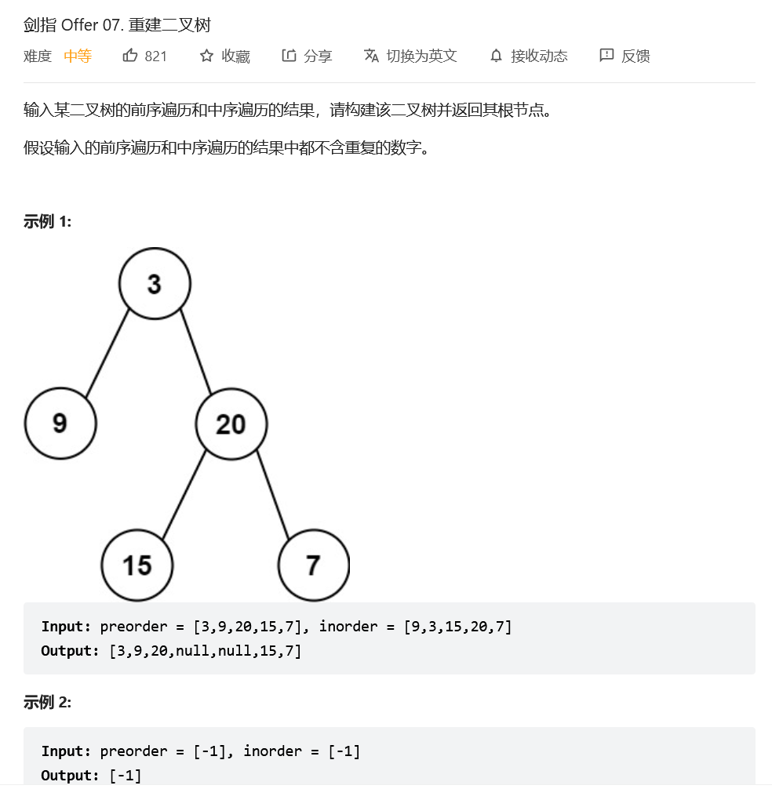
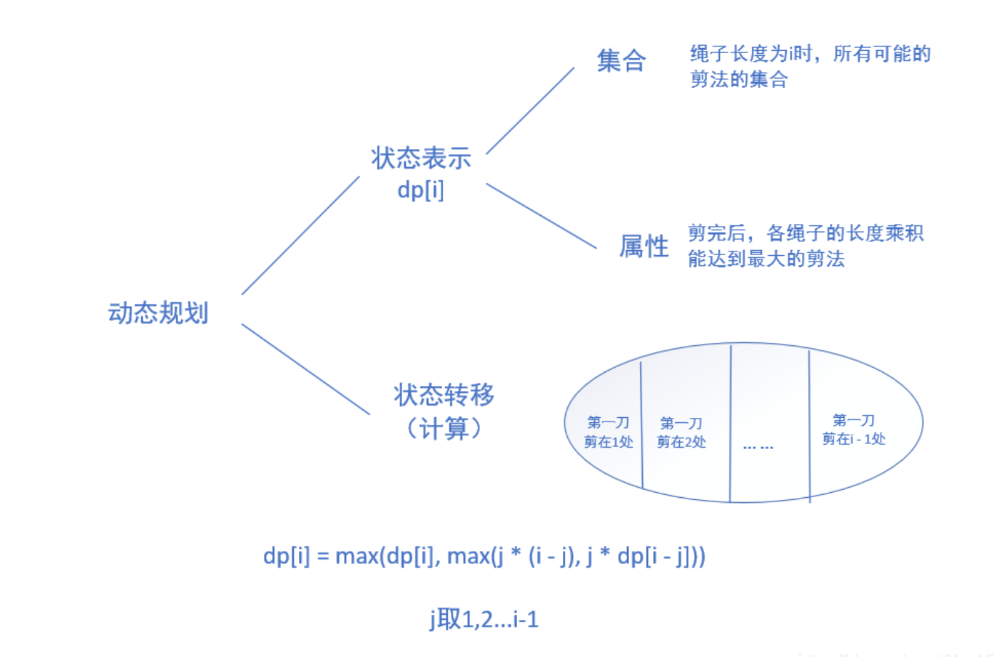
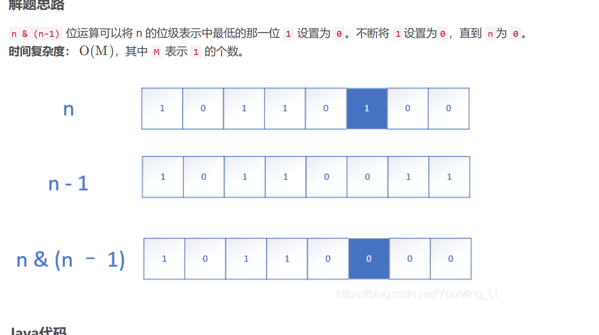
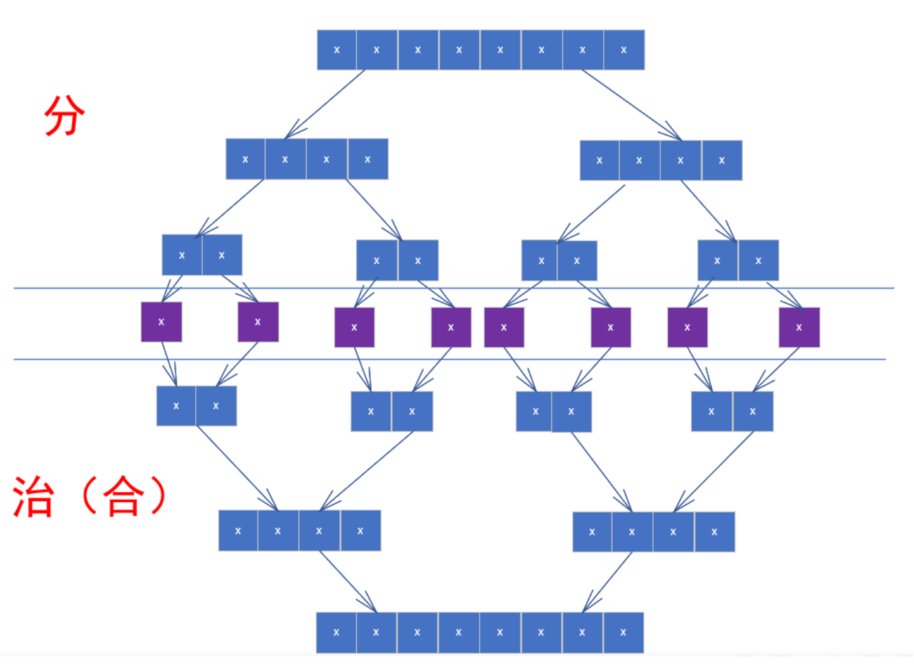
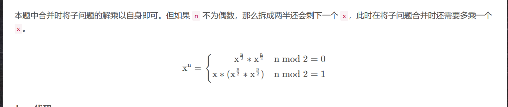
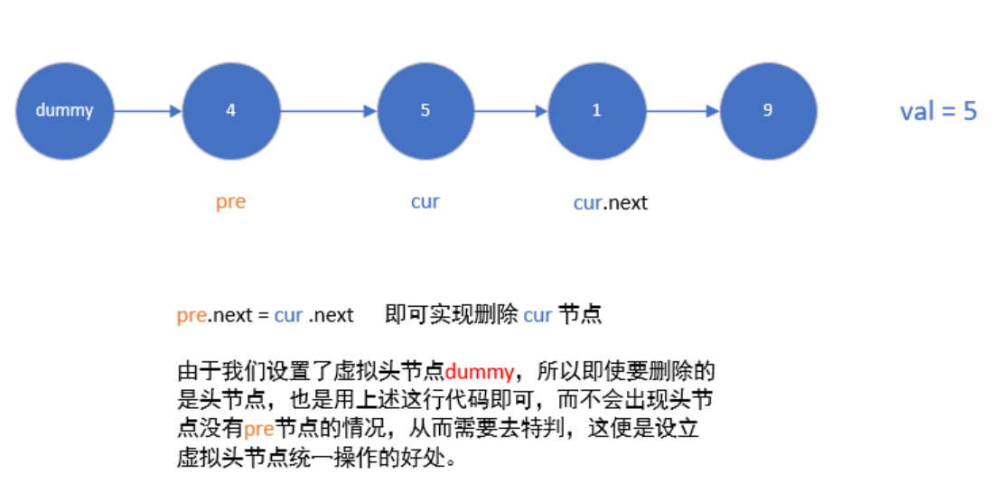
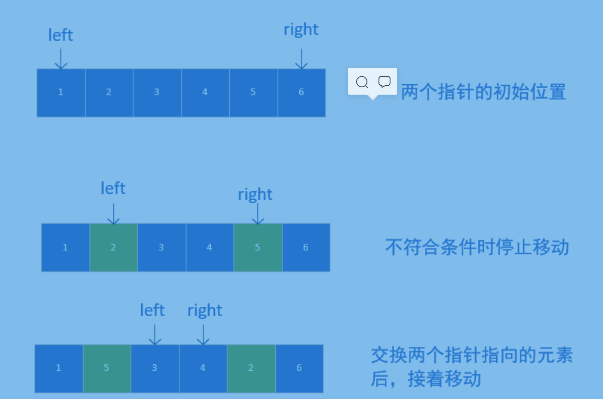
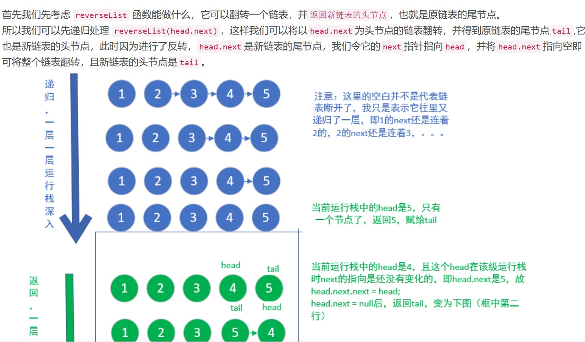
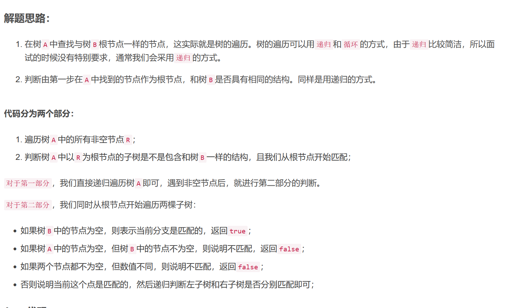
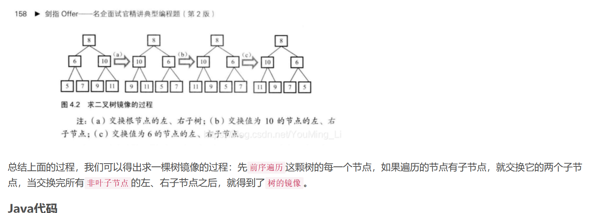

#剑指offer刷题
 #DAY 6.24
  
  前序遍历：根左右
  中序遍历：左根右
  解法：递归 自己调用自己 只需找到跟节点 以及左右子树每一次的前序遍历以及中序遍历
  09
  解法 使用两个辅助栈 append就直接加上去 delete方法将主栈的内容弹到辅助站 辅助站在弹出
  13
  解法DFS深度搜索 青蛙能跳到的地方即为能到达 调到的地方的四周即为能访问 一个boolean数组记录跳的位置是否已访问
  已访问且已满足条件 计数加一
  14
  动态规划
  
  状态表示：dp[ i ]存储绳子长度为i时的最大乘积。那么dp[n]即绳子长度为n时的最大乘积。

集合划分： 依题意，绳子至少被剪一次，所以绳子长度最小为2。由于已知至少剪一刀，我们索性假设第一刀剪在长度为j的位置(即第一段绳子长度为j)。剩下的那段长度为( i - j )的绳子就变成了“可剪可不剪”。那究竟是“不剪了”得到的乘积大呢，还是“继续剪余下的这段”得到乘积更大？我们不知道，所以需要两种情况都计算一下进行比较。其中，“不剪了”得到的乘积是j * ( i - j )，“继续剪”得到的乘积是j * dp[ i - j ]。取其中的较大值，就是“第一剪在j位置”能得到的最大乘积。而第一剪的所有可能位置是1,2,…,i-1。依次计算所有可能情况，取最大值即为dp[ i ]的值。

 15俄罗斯方块 一个一个1 消去
 
 16 整数幂
 
 
 18  给定单向链表的头指针和一个要删除的节点的值，定义一个函数删除该节点。
*
* 返回删除后的链表的头节点。

  19 正则表达式
  b站视频
  https://www.bilibili.com/video/BV1ZE411P7mS?spm_id_from=333.337.search-card.all.click&vd_source=d29cb08e3ad363cbedf86a25badae61c
  20 有效数字
  b站视频
  https://www.bilibili.com/video/BV1G7411U7ti?spm_id_from=333.337.search-card.all.click&vd_source=d29cb08e3ad363cbedf86a25badae61c
  21
  
  22
   定义两个指针 一个先走k步 然后两个一起走 第一个走到最后是 第二个刚好少走了k步
  24链表翻转
  
  26 判断是不是一个树的另一个部分
  
  28 镜像二叉树
  